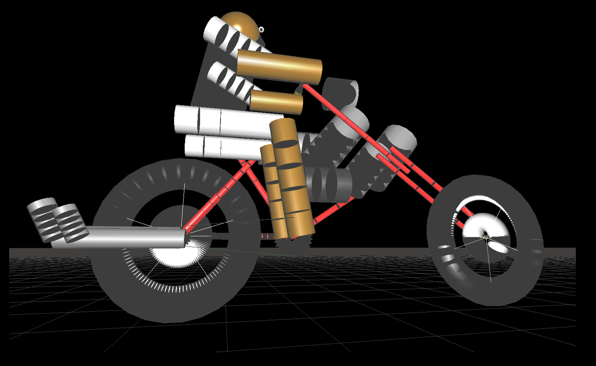

# 3-D Bike Simulation

## How to Run :
1. Download the code or clone the git repo in Xcode
2. Press Run Button .
3. Enjoy

## Controls :

To reset the scene, key to be used is ‘r’ or ‘R’.
Acceleration of the bike is controlled by ‘+‘.
De-acceleration is done using the key ‘-‘.
Movement of the bike is controlled by the keys ‘1’-left and ‘2’-right.
Zooming in is controlled by the UP arrow key.
Zoom out is controlled by the DOWN arrow key.
To move the camera towards left, key to be used is LEFT arrow key.
To move the camera towards right, key to be used is RIGHT arrow key. 

## Future Enhancements

These are the features that are planned to be supported in the future 
* Simulating smoke from exhaust pipe
* Perform wheelie by the rider
* To improve the looks of the rider 
* To implement shadow using more built-in functions 

## Snapshots : 

